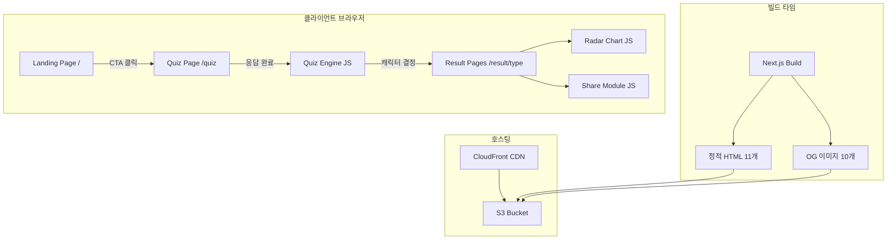
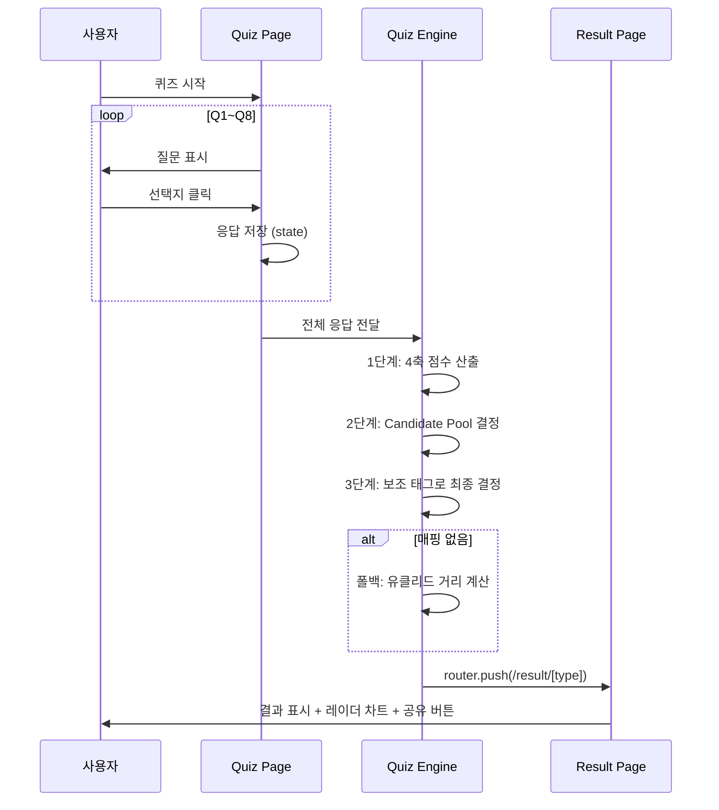

# Design Document: Kiro Friends

## Overview

Kiro Friends는 한국 전통 설화 캐릭터 기반 개발자 성향 테스트 웹앱이다. Next.js Static Export를 사용하여 100% 정적 사이트로 구현하며, S3 + CloudFront로 호스팅한다. 모든 퀴즈 로직은 클라이언트 사이드 JavaScript로 실행되고, 결과 페이지 9개와 OG 이미지 10개는 빌드 타임에 사전 생성된다.

핵심 기술 결정:
- Next.js 14+ App Router + Static Export (`output: 'export'`)
- Tailwind CSS (스타일링)
- Chart.js (레이더 차트)
- 빌드 타임 OG 이미지 생성 (Satori + @vercel/og 또는 node-canvas)
- 카카오 JavaScript SDK (카카오톡 공유)

## Architecture



### 페이지 라우팅 구조

```
out/
├── index.html                    ← Landing Page
├── quiz/index.html               ← Quiz Page (SPA)
├── result/
│   ├── gatssn/index.html         ← 갓쓴키로
│   ├── chonggak/index.html       ← 총각귀신
│   ├── cheonyeo/index.html       ← 처녀귀신
│   ├── dokkaebi/index.html       ← 도깨비
│   ├── gumiho/index.html         ← 구미호
│   ├── haetae/index.html         ← 해태
│   ├── jangseung/index.html      ← 장승
│   ├── jeoseung/index.html       ← 저승사자
│   └── mulgwisin/index.html      ← 물귀신
└── og/
    ├── default.png               ← 랜딩용 OG
    └── [type].png                ← 캐릭터별 OG (9개)
```

### 데이터 흐름



## Components and Interfaces

### 1. 페이지 컴포넌트

```typescript
// app/page.tsx - Landing Page
interface LandingPageProps {}
// 9개 캐릭터 이모지 원형 배치, CTA 버튼, 참여 안내

// app/quiz/page.tsx - Quiz Page
interface QuizPageState {
  currentQuestion: number;       // 0~7
  answers: (number | null)[];    // 8개 응답 저장
}

// app/result/[type]/page.tsx - Result Page
interface ResultPageProps {
  params: { type: CharacterSlug };
}
```

### 2. Quiz Engine

```typescript
// lib/quiz-engine.ts

interface AxisScores {
  A: number;  // 안정(-1) ↔ 실험(+1)
  B: number;  // 구조(-1) ↔ 즉흥(+1)
  C: number;  // 개인(-1) ↔ 협업(+1)
  D: number;  // 품질(-1) ↔ 속도(+1)
}

interface AuxiliaryTags {
  설계: number;
  UX: number;
  부채청산: number;
  몰입: number;
  자동화: number;
  연결: number;
  테스트: number;
  거버넌스: number;
}

// 4축 점수 산출
function calculateAxisScores(answers: number[]): AxisScores;

// 후보군 결정
function determineCandidatePool(scores: AxisScores): CharacterSlug[];

// 보조 태그 집계
function calculateAuxiliaryTags(answers: number[]): AuxiliaryTags;

// 최종 캐릭터 결정
function determineCharacter(
  candidatePool: CharacterSlug[],
  tags: AuxiliaryTags
): CharacterSlug;

// 폴백: 유클리드 거리 매칭
function euclideanFallback(
  scores: AxisScores,
  tags: AuxiliaryTags
): CharacterSlug;

// 메인 엔트리: 전체 응답 → 최종 캐릭터
function getResult(answers: number[]): CharacterSlug;
```

### 3. Character Data

```typescript
// data/characters.ts

type CharacterSlug =
  | 'gatssn' | 'chonggak' | 'cheonyeo'
  | 'dokkaebi' | 'gumiho' | 'haetae'
  | 'jangseung' | 'jeoseung' | 'mulgwisin';

interface CharacterProfile {
  slug: CharacterSlug;
  emoji: string;
  name: string;            // 유형명 (예: "갓쓴키로형")
  title: string;           // 부제 (예: "전략 설계자")
  description: string;     // 한 줄 소개
  axisValues: AxisScores;  // 캐릭터 기준 4축 값
  primaryTag: string;      // 핵심 보조 태그
  strengths: string[];     // 잘하는 점
  pitfalls: string[];      // 빠지기 쉬운 함정
  kiroFeatures: KiroFeature[];  // 추천 Kiro 기능 (상위 3개)
  aiTips: string[];        // AI 협업 팁 프롬프트 예시
  synergy: CharacterSlug;  // 시너지 캐릭터
  tension: CharacterSlug;  // 긴장 캐릭터
}

interface KiroFeature {
  name: string;
  description: string;
}
```

### 4. Question Data

```typescript
// data/questions.ts

interface Question {
  id: number;              // 1~8
  text: string;            // 질문 텍스트
  options: QuestionOption[];
}

interface QuestionOption {
  text: string;            // 선택지 텍스트
  axisEffect?: {           // Q1~Q4: 축 점수 영향
    axis: 'A' | 'B' | 'C' | 'D';
    value: -1 | 1;
  };
  tagEffect?: string;      // Q5~Q8: 보조 태그
}
```

### 5. Share Module

```typescript
// lib/share.ts

// X (Twitter) 공유
function shareToX(character: CharacterProfile, resultUrl: string): void;

// LinkedIn 공유
function shareToLinkedIn(resultUrl: string): void;

// 링크 복사
function copyLink(resultUrl: string): Promise<boolean>;
```

### 6. UI 컴포넌트

```typescript
// components/RadarChart.tsx
interface RadarChartProps {
  scores: AxisScores;
}

// components/ShareButtons.tsx
interface ShareButtonsProps {
  character: CharacterProfile;
  resultUrl: string;
}

// components/CharacterCard.tsx
interface CharacterCardProps {
  character: CharacterProfile;
  compact?: boolean;  // 미리보기 슬라이드용
}

// components/ProgressBar.tsx
interface ProgressBarProps {
  current: number;  // 0~7
  total: number;    // 8
}

// components/CTASection.tsx
interface CTASectionProps {
  character: CharacterProfile;
}

// components/CharacterSlider.tsx
// 9개 캐릭터 미리보기 슬라이드
interface CharacterSliderProps {
  characters: CharacterProfile[];
  currentType?: CharacterSlug;
}
```

## Data Models

### Character Profile 데이터 (9개)

| 슬러그 | 이모지 | 유형명 | 4축 (A,B,C,D) | 핵심 태그 |
|---|---|---|---|---|
| gatssn | 👑 | 갓쓴키로형 | (-1,-1,-1,-1) | 설계 |
| chonggak | 👻 | 총각귀신형 | (-1,+1,-1,+1) | 몰입 |
| cheonyeo | 👰 | 처녀귀신형 | (-1,-1,-1,-1) | UX |
| dokkaebi | 👹 | 도깨비형 | (+1,+1,-1,+1) | - |
| gumiho | 🦊 | 구미호형 | (+1,-1,-1,+1) | 자동화 |
| haetae | 🦁 | 해태형 | (-1,-1,+1,-1) | 테스트 |
| jangseung | 🪵 | 장승형 | (-1,-1,+1,-1) | 거버넌스 |
| jeoseung | ⚰️ | 저승사자형 | (-1,-1,-1,-1) | 부채청산 |
| mulgwisin | 🌊 | 물귀신형 | (-1,+1,+1,+1) | 연결 |

### 4축 매핑 테이블

| 4축 조합 (A,B,C,D) | Candidate Pool |
|---|---|
| (안정, 구조, 개인, 품질) = (-1,-1,-1,-1) | [gatssn, cheonyeo, jeoseung] |
| (안정, 즉흥, 개인, 속도) = (-1,+1,-1,+1) | [chonggak] |
| (실험, 즉흥, 개인, 속도) = (+1,+1,-1,+1) | [dokkaebi] |
| (실험, 구조, 개인, 속도) = (+1,-1,-1,+1) | [gumiho] |
| (안정, 구조, 협업, 품질) = (-1,-1,+1,-1) | [haetae, jangseung] |
| (안정, 즉흥, 협업, 속도) = (-1,+1,+1,+1) | [mulgwisin] |
| 그 외 | Euclidean Fallback |

### 시너지/긴장 관계

| 캐릭터 | 시너지 | 긴장 |
|---|---|---|
| 갓쓴키로 | 도깨비 | 총각귀신 |
| 총각귀신 | 구미호 | 저승사자 |
| 처녀귀신 | 해태 | 도깨비 |
| 도깨비 | 갓쓴키로 | 해태 |
| 구미호 | 총각귀신 | 장승 |
| 해태 | 저승사자 | 도깨비 |
| 장승 | 갓쓴키로 | 구미호 |
| 저승사자 | 해태 | 총각귀신 |
| 물귀신 | 구미호 | 저승사자 |

### Question 데이터 구조

Q1~Q4: 각 질문은 2개 선택지, 각 선택지는 하나의 축에 -1 또는 +1 영향
Q5~Q8: 각 질문은 4개 선택지, 각 선택지는 하나의 보조 태그에 +1 영향


## Correctness Properties

*A property is a characteristic or behavior that should hold true across all valid executions of a system—essentially, a formal statement about what the system should do. Properties serve as the bridge between human-readable specifications and machine-verifiable correctness guarantees.*

### Property 1: 4축 점수 산출 정확성

*For any* Q1~Q4 응답 조합(각 질문당 2개 선택지 중 하나), calculateAxisScores 함수는 각 질문의 선택지에 따라 해당 축에 정확히 -1 또는 +1을 부여하고, 결과 AxisScores의 각 축 값은 -1 또는 +1이어야 한다.

**Validates: Requirements 3.1**

### Property 2: 후보군 결정 일관성

*For any* 유효한 AxisScores에 대해, determineCandidatePool 함수는 사전 정의된 매핑 테이블에 해당하는 경우 올바른 Candidate_Pool을 반환하고, 매핑 테이블에 없는 경우 Euclidean_Fallback을 통해 비어있지 않은 후보군을 반환해야 한다.

**Validates: Requirements 3.2, 5.1**

### Property 3: 보조 태그 집계 정확성

*For any* Q5~Q8 응답 조합(각 질문당 4개 선택지 중 하나), calculateAuxiliaryTags 함수는 각 선택지에 해당하는 태그에 정확히 +1을 부여하고, 모든 태그 점수의 합은 항상 4(질문 수)여야 한다.

**Validates: Requirements 4.1**

### Property 4: 최종 캐릭터 결정 규칙

*For any* 후보군과 보조 태그 점수 조합에 대해, determineCharacter 함수는 후보군이 복수인 경우 해당 후보군의 결정 규칙(설계→갓쓴키로, UX→처녀귀신, 부채청산→저승사자 / 테스트→해태, 거버넌스→장승)에 따라 올바른 캐릭터를 반환하고, 동점 시 후보군의 첫 번째 캐릭터를 반환해야 한다.

**Validates: Requirements 4.2, 4.3, 4.4**

### Property 5: 유클리드 폴백 최근접 보장

*For any* 매핑 테이블에 없는 4축 점수에 대해, euclideanFallback 함수가 반환하는 캐릭터는 모든 캐릭터 프로필 중 유클리드 거리가 가장 짧은(또는 동일한) 캐릭터의 후보군에서 선택된 것이어야 한다.

**Validates: Requirements 5.2, 5.3**

### Property 6: 전체 퀴즈 결과 유효성

*For any* 유효한 8문항 응답 조합에 대해, getResult 함수는 항상 9개 유효한 CharacterSlug 중 하나를 반환해야 한다.

**Validates: Requirements 3.1, 3.2, 4.1, 4.2, 4.3, 5.1, 5.2, 5.3**

### Property 7: 캐릭터 데이터 무결성

*For any* CharacterProfile에 대해, 이모지, 유형명, 한 줄 소개, 4축 값, 핵심 보조 태그, 잘하는 점, 빠지기 쉬운 함정, 추천 Kiro 기능(3개), AI 협업 팁, 시너지 캐릭터, 긴장 캐릭터 필드가 모두 존재하고 비어있지 않아야 하며, 슬러그는 9개 모두 고유해야 한다.

**Validates: Requirements 12.1, 12.2, 12.3**

### Property 8: SNS 공유 파라미터 생성

*For any* CharacterProfile과 결과 URL에 대해, 각 SNS 공유 함수(shareToX, shareToKakao, shareToLinkedIn)가 생성하는 공유 데이터는 캐릭터 유형명, 결과 URL을 포함해야 하며, X 공유의 경우 해시태그(#KiroFriends)를 포함해야 한다.

**Validates: Requirements 7.2, 7.3, 7.4**

### Property 9: OG 메타태그 캐릭터별 설정

*For any* 캐릭터 슬러그에 대해, 해당 Result_Page의 OG 메타태그는 캐릭터의 유형명을 og:title에, 한 줄 소개를 og:description에, `/og/[slug].png` 경로를 og:image에 포함해야 한다.

**Validates: Requirements 8.2**

### Property 10: 퀴즈 진행 상태 표시

*For any* 퀴즈 진행 단계(0~7)에서, 표시되는 진행 상태 텍스트는 `(현재+1)/8` 형식이어야 한다.

**Validates: Requirements 2.3**

## Error Handling

### 잘못된 캐릭터 슬러그 접근
- `/result/[type]`에서 유효하지 않은 슬러그로 접근 시 404 페이지 표시 또는 랜딩 페이지로 리다이렉트
- Next.js의 `generateStaticParams`로 유효한 슬러그만 빌드 타임에 생성

### 퀴즈 중간 이탈
- 퀴즈 페이지 새로고침 시 처음부터 다시 시작 (상태는 React state로만 관리, 별도 영속화 없음)
- `/quiz` 직접 접근 시 Q1부터 정상 시작

### 카카오 SDK 로드 실패
- SDK 로드 실패 시 카카오톡 공유 버튼 비활성화 또는 숨김 처리
- 다른 공유 수단(X, LinkedIn, 링크 복사)은 정상 동작 유지

### 클립보드 API 미지원
- `navigator.clipboard` 미지원 브라우저에서 `document.execCommand('copy')` 폴백 사용
- 폴백도 실패 시 사용자에게 URL을 직접 복사하도록 안내

### Chart.js 렌더링 실패
- Canvas 미지원 환경에서 레이더 차트 대신 텍스트 기반 4축 점수 표시

## Testing Strategy

### 단위 테스트 (Unit Tests)

테스트 프레임워크: Jest + React Testing Library

단위 테스트 대상:
- `calculateAxisScores`: 특정 응답 조합에 대한 예상 점수 확인
- `determineCandidatePool`: 6개 매핑 테이블 각각에 대한 정확한 후보군 확인 (edge cases)
- `calculateAuxiliaryTags`: 특정 응답에 대한 태그 점수 확인
- `determineCharacter`: 동점 시 기본값 선택 확인 (edge case)
- `euclideanFallback`: 특정 비매핑 점수에 대한 결과 확인
- 공유 URL 생성 함수: 특정 캐릭터에 대한 URL 형식 확인
- 캐릭터 데이터: 9개 캐릭터 데이터 존재 및 필수 필드 확인

### 속성 기반 테스트 (Property-Based Tests)

테스트 라이브러리: fast-check

각 property 테스트는 최소 100회 반복 실행한다.

각 테스트에는 다음 형식의 태그 주석을 포함한다:
```
// Feature: kiro-friends, Property N: [property title]
```

Property 테스트 목록:
1. **Property 1**: 임의의 Q1~Q4 응답 → 4축 점수 범위 및 정확성
2. **Property 2**: 임의의 AxisScores → 비어있지 않은 후보군 반환
3. **Property 3**: 임의의 Q5~Q8 응답 → 태그 점수 합 = 4
4. **Property 4**: 임의의 후보군 + 태그 → 결정 규칙 준수
5. **Property 5**: 비매핑 점수 → 최근접 캐릭터 선택
6. **Property 6**: 임의의 8문항 응답 → 유효한 CharacterSlug 반환
7. **Property 7**: 모든 캐릭터 데이터 무결성 검증
8. **Property 8**: 임의의 캐릭터 + URL → 공유 파라미터 포함 확인
9. **Property 9**: 임의의 슬러그 → OG 메타태그 정확성
10. **Property 10**: 임의의 진행 단계 → 진행 상태 텍스트 정확성

### 통합 테스트

- 퀴즈 전체 플로우: 8문항 응답 → 결과 페이지 이동 확인
- 공유 링크 진입: `/result/[type]` 직접 접근 → 결과 표시 확인
- 빌드 결과물: 11개 HTML + 10개 OG 이미지 생성 확인
